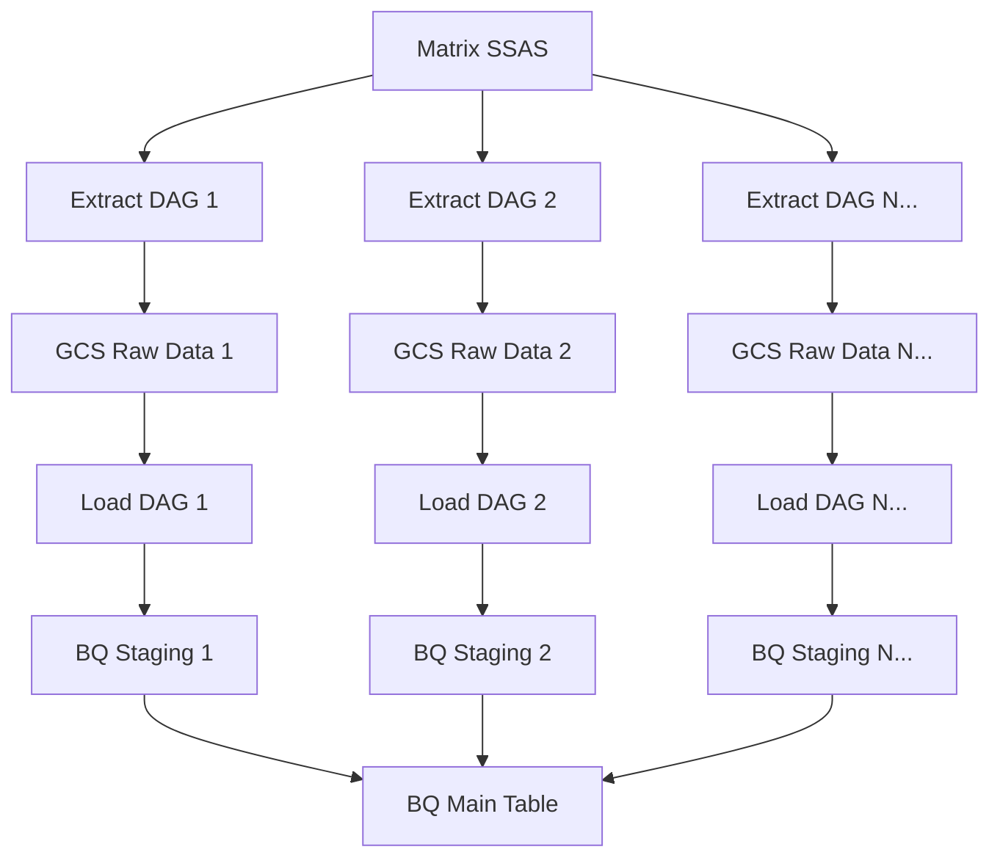
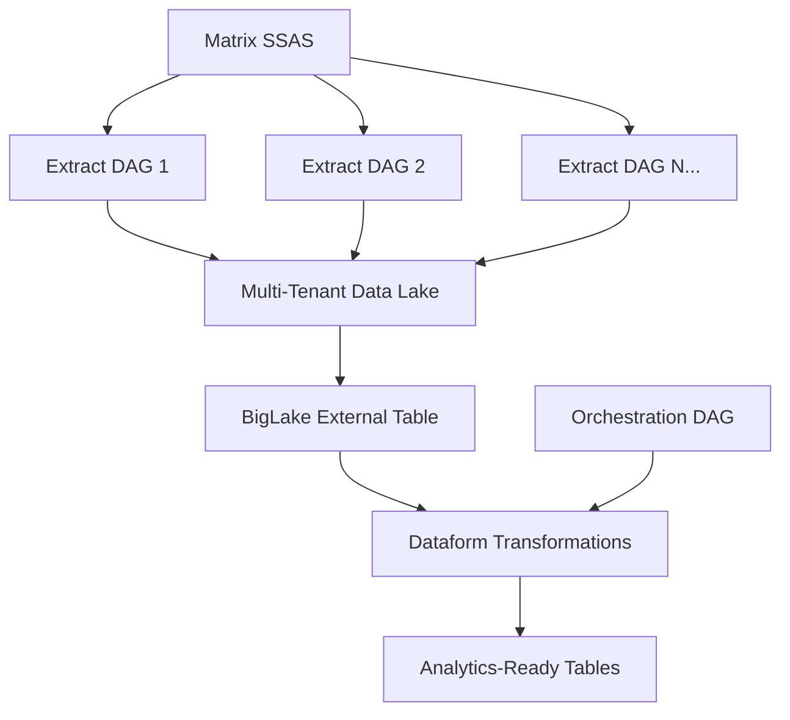

# BigLake + Dataform Multi-Tenant Architecture

## Overview

This document outlines the design for a modern data lake architecture using BigLake external tables and Dataform for the Matrix data pipeline. This approach replaces the complex multi-DAG ETL pattern with a simplified ELT architecture that provides immediate data availability, better scalability, and reduced operational overhead.

## Current State vs Future State

### Current Architecture (Complex)


**Problems:**
- 12+ DAGs to manage (6 extract + 6 load)
- Complex inter-DAG dependencies
- Data not available until load completes
- Staging table management overhead
- Custom Python logic for schema/merge operations

### Future Architecture (Simple)


**Benefits:**
- 6 extract DAGs + 1 orchestration DAG
- No complex dependencies
- Immediate data availability
- No staging table management
- SQL-based transformations in version control

## Architecture Components

### 1. Multi-Tenant Data Lake Structure

#### GCS Bucket Organization
```
gs://au-accel-mdw-dev-data/matrix/raw/
├── year=2025/
│   ├── month=03/
│   │   ├── week=20250302/
│   │   │   ├── client=cba/
│   │   │   │   └── booking_spot.csv
│   │   │   └── client=dpe/
│   │   │       └── booking_spot.csv
│   │   └── week=20250309/
│   │       └── client=cba/
│   │           └── booking_spot.csv
│   └── month=09/
│       └── week=20250925/
│           ├── client=cba/
│           │   └── booking_spot.csv
│           ├── client=dpe/
│           │   └── booking_spot.csv
│           ├── client=ford/
│           │   └── booking_spot.csv
│           └── client=allianz/
│               └── booking_spot.csv
├── year=2024/
│   └── month=12/
│       └── week=20241230/
│           └── client=cba/
│               └── booking_spot.csv
└── year=2023/
    └── month=06/
        ├── week=backfill_ford_20230601/
        │   └── client=ford/
        │       └── booking_spot.csv     # Contains 2023-06-01 to 2023-12-31 data
        └── week=20230612/
            └── client=ford/
                └── booking_spot.csv     # Contains 2023-06-12 to 2023-06-18 data
```

#### Key Design Principles
- **Date-First Hive Partitioning**: Uses `year=YYYY/month=MM/week=batch_id/client=name` format for optimal time-based query performance
- **Consistent Schema**: All files share the same CSV structure regardless of data granularity
- **Mixed Granularity Support**: Handles both bulk historical loads and incremental updates through flexible batch identifiers
- **Client Isolation**: Clear separation by client partition within each time period
- **Time-Optimized Organization**: Year/month hierarchy enables efficient partition elimination for time-based queries
- **Flexible Week Partitions**: Week partitions serve as batch identifiers rather than strict temporal boundaries, allowing backfill data to be placed appropriately

### 2. BigLake External Table

#### Table Definition
```sql
CREATE EXTERNAL TABLE `au-accel-mdw-dev.L01_raw_matrix.matrix_booking_spot_multi_tenant`
OPTIONS (
  format = 'CSV',
  uris = ['gs://au-accel-mdw-dev-data/matrix/raw/year=*/month=*/week=*/client=*/booking_spot.csv'],
  skip_leading_rows = 1,
  hive_partition_uri_prefix = 'gs://au-accel-mdw-dev-data/matrix/raw',
  allow_jagged_rows = false,
  allow_quoted_newlines = false
);
```

#### Automatic Capabilities
- **Partition Discovery**: Automatically detects new year/month/week/client partitions
- **Schema Inference**: Treats all columns as STRING for maximum flexibility
- **Immediate Availability**: Data queryable as soon as files land in GCS
- **Cost Optimization**: Only scans relevant partitions based on WHERE clauses, with date-first partitioning providing optimal performance for time-based queries

### 3. Dataform Transformations

#### Project Structure
```
dataform/
├── definitions/
│   ├── sources/
│   │   └── matrix_raw.sqlx
│   ├── staging/
│   │   ├── stg_matrix_cba.sqlx
│   │   ├── stg_matrix_dpe.sqlx
│   │   ├── stg_matrix_ford.sqlx
│   │   └── stg_matrix_all_clients.sqlx
│   └── marts/
│       ├── dim_clients.sqlx
│       ├── fact_booking_spots.sqlx
│       └── metrics_client_summary.sqlx
├── includes/
│   └── client_utils.js
└── dataform.json
```

#### Source Definition
```sql
-- definitions/sources/matrix_raw.sqlx
config {
  type: "declaration",
  database: "au-accel-mdw-dev",
  schema: "L01_raw_matrix",
  name: "matrix_booking_spot_multi_tenant"
}
```

#### Staging Models
```sql
-- definitions/staging/stg_matrix_cba.sqlx
config {
  type: "view",
  schema: "L02_staging_matrix"
}

SELECT 
  client,
  year,
  month, 
  week,
  -- Type cast raw string columns to appropriate types
  SAFE_CAST(SpotId AS INT64) as spot_id,
  SAFE_CAST(BookingDate AS DATE) as booking_date,
  SAFE_CAST(Amount AS FLOAT64) as amount,
  -- Add metadata columns
  CURRENT_TIMESTAMP() as _loaded_at,
  _FILE_NAME as _source_file
FROM ${ref("matrix_booking_spot_multi_tenant")}
WHERE client = 'cba'
  AND year >= '2025'  -- Partition elimination for optimal performance
```

#### Dynamic Client Discovery
```sql
-- definitions/staging/stg_matrix_all_clients.sqlx
config {
  type: "table",
  schema: "L02_staging_matrix",
  materialized: "incremental"
}

SELECT 
  client,
  year,
  month,
  week,
  SAFE_CAST(SpotId AS INT64) as spot_id,
  SAFE_CAST(BookingDate AS DATE) as booking_date,
  SAFE_CAST(Amount AS FLOAT64) as amount,
  CURRENT_TIMESTAMP() as _loaded_at,
  _FILE_NAME as _source_file
FROM ${ref("matrix_booking_spot_multi_tenant")}
${ when(incremental(), `WHERE _PARTITIONDATE >= CURRENT_DATE() - 7`) }
```

#### Analytics-Ready Tables
```sql
-- definitions/marts/fact_booking_spots.sqlx
config {
  type: "table",
  schema: "L03_marts_matrix",
  bigquery: {
    partitionBy: "booking_date",
    clusterBy: ["client", "spot_id"]
  }
}

SELECT 
  client,
  spot_id,
  booking_date,
  amount,
  -- Business logic transformations
  EXTRACT(YEAR FROM booking_date) as booking_year,
  EXTRACT(QUARTER FROM booking_date) as booking_quarter,
  CASE 
    WHEN amount > 10000 THEN 'High Value'
    WHEN amount > 1000 THEN 'Medium Value'
    ELSE 'Low Value'
  END as value_tier,
  _loaded_at
FROM ${ref("stg_matrix_all_clients")}
WHERE spot_id IS NOT NULL
  AND booking_date IS NOT NULL
  AND amount > 0
```

### 4. Extract DAG Modifications

#### Partition Structure Rationale
The date-first partitioning structure (`year=*/month=*/week=*/client=*`) is optimized for the most common query patterns:

**Query Performance Comparison:**

| Query Type | Date-First Performance | Client-First Performance |
|------------|----------------------|-------------------------|
| Time-based (all clients) | **Excellent** - Single partition scan | Poor - Must scan all client partitions |
| Time + Client specific | **Good** - Partition + filter | Good - Direct partition access |
| Client-only queries | Acceptable - Multiple partitions + filter | Excellent - Single client partition |

Since most analytics queries are time-based ("Show me this quarter's performance across all clients"), the date-first structure provides optimal cost and performance characteristics.

#### Flexible Week Partitions for Mixed Granularity
The `week=` partition serves as a **batch identifier** rather than a strict temporal boundary. This enables seamless handling of both backfill and incremental data:

**Backfill Data Placement:**
```
year=2023/month=06/week=backfill_ford_20230601/client=ford/booking_spot.csv  # 6 months of data
year=2024/month=01/week=backfill_ford_20240101/client=ford/booking_spot.csv  # 12 months of data
```

**Incremental Data Placement:**
```
year=2025/month=09/week=20250925/client=ford/booking_spot.csv                # 1 week of data
```

**Key Benefits:**
- BigQuery doesn't care about the semantic meaning of partition values
- Files can contain any date range regardless of partition name  
- Partition elimination works based on partition structure, not content
- Queries work identically across backfill and incremental data

#### Updated File Path Logic
```python
# Modified extract command in matrix_export_to_gcs.py
def get_gcs_output_path(client_name, start_date, end_date, is_backfill=False):
    """Generate hive-partitioned path for multi-tenant storage with date-first partitioning"""
    start_dt = datetime.strptime(start_date, '%Y-%m-%d')
    
    # Use start date for partition placement
    year = start_dt.strftime('%Y')
    month = start_dt.strftime('%m')
    
    # Generate batch identifier for week partition
    if is_backfill:
        start_str = start_date.replace('-', '')
        week = f"backfill_{client_name}_{start_str}"
    else:
        # Regular weekly partition using end date
        end_dt = datetime.strptime(end_date, '%Y-%m-%d')
        week = end_dt.strftime('%Y%m%d')
    
    return f"matrix/raw/year={year}/month={month}/week={week}/client={client_name}/"

# Usage examples:
# Backfill: matrix/raw/year=2023/month=06/week=backfill_ford_20230601/client=ford/
# Regular:  matrix/raw/year=2025/month=09/week=20250925/client=ford/
```

### 5. Orchestration DAG

#### Simplified Orchestration
```python
# New DAG: dataform_matrix_orchestration.py
from airflow.providers.google.cloud.operators.dataform import (
    DataformCreateCompilationResultOperator,
    DataformCreateWorkflowInvocationOperator
)

@dag(
    dag_id='matrix_dataform_orchestration',
    description='Orchestrate Dataform transformations for Matrix data',
    schedule='0 4 * * 1',  # Monday 4 AM, after weekend extracts
    start_date=datetime(2025, 1, 1),
    catchup=False,
    max_active_runs=1,
)
def matrix_dataform_pipeline():
    
    @task
    def check_new_data_available():
        """Check if new data has arrived for any client in the last week"""
        from google.cloud import storage
        
        client = storage.Client()
        bucket = client.bucket(DATA_BUCKET)
        
        # Check for files newer than last successful run with date-first structure
        cutoff_date = context['prev_data_interval_end'] or (datetime.now() - timedelta(days=7))
        
        new_files = []
        for blob in bucket.list_blobs(prefix='matrix/raw/year='):
            if blob.time_created > cutoff_date:
                new_files.append(blob.name)
        
        if not new_files:
            raise AirflowSkipException("No new data found")
            
        return {"new_files_count": len(new_files)}

    compile_dataform = DataformCreateCompilationResultOperator(
        task_id="compile_dataform_matrix",
        project_id=PROJECT_ID,
        region="us-central1",
        repository_id="matrix-transformations",
        compilation_result={
            "git_commitish": "main"
        }
    )

    run_dataform = DataformCreateWorkflowInvocationOperator(
        task_id="run_dataform_matrix",
        project_id=PROJECT_ID,
        region="us-central1",
        repository_id="matrix-transformations",
        workflow_invocation={
            "compilation_result": "{{ ti.xcom_pull(task_ids='compile_dataform_matrix')['name'] }}",
            "invocation_config": {
                "included_targets": [
                    {"database": "au-accel-mdw-dev", "schema": "L02_staging_matrix"},
                    {"database": "au-accel-mdw-dev", "schema": "L03_marts_matrix"}
                ]
            }
        }
    )

    check_new_data_available() >> compile_dataform >> run_dataform

matrix_dataform_pipeline()
```

## Implementation Roadmap

### Phase 1: Foundation Setup (Week 1-2)
1. **Create Multi-Tenant External Table**
   - Define BigLake external table with hive partitioning
   - Test partition discovery and querying
   - Validate schema inference and type casting

2. **Update Extract DAGs**
   - Modify GCS output paths to use hive partitioning
   - Update existing clients to write to new structure
   - Test backfill data placement

3. **Basic Dataform Setup**
   - Initialize Dataform repository
   - Create source declarations
   - Build basic staging models for existing clients

### Phase 2: Core Transformations (Week 3-4)
1. **Staging Layer Development**
   - Per-client staging views
   - Unified multi-client staging table
   - Data quality validations and type casting

2. **Marts Layer Development**
   - Analytics-ready fact tables with partitioning/clustering
   - Dimension tables for clients and metadata
   - Business logic transformations

3. **Testing and Validation**
   - Data quality tests in Dataform
   - Performance testing with partition elimination
   - Comparison with existing data for validation

### Phase 3: Migration and Optimization (Week 5-6)
1. **Production Migration**
   - Migrate existing client data to new structure
   - Switch extract DAGs to new output paths
   - Deploy Dataform orchestration DAG

2. **Legacy Cleanup**
   - Deprecate existing load DAGs
   - Remove staging table logic
   - Archive old BigQuery tables

3. **Monitoring and Documentation**
   - Set up monitoring for external table freshness
   - Create operational runbooks
   - Update team documentation

## Benefits Realization

### Operational Benefits
- **75% Reduction in DAG Count**: From 12+ DAGs to 7 DAGs total
- **Immediate Data Availability**: Query data as soon as it lands in GCS
- **Zero Staging Management**: No more create/drop staging table logic
- **Simplified Dependencies**: Linear flow instead of complex inter-DAG dependencies
- **Self-Service Analytics**: Business users can query raw data immediately

### Technical Benefits
- **Version-Controlled Transformations**: All SQL logic in Git via Dataform
- **Automatic Schema Evolution**: Add columns without code changes
- **Cost Optimization**: Pay only for storage (GCS) + compute (queries)
- **Better Performance**: Partition elimination and columnar optimization
- **Improved Testing**: Built-in data quality testing in Dataform

### Business Benefits
- **Faster Time-to-Insight**: Data available for analysis immediately
- **Reduced Operational Overhead**: Less custom code to maintain
- **Improved Data Quality**: SQL-based validations and transformations
- **Enhanced Scalability**: Easy to add new clients and data sources
- **Better Compliance**: Clear data lineage and transformation audit trail

## Risk Mitigation

### Data Quality Risks
- **Mitigation**: Comprehensive Dataform data tests
- **Validation**: Schema validation on CSV files before upload
- **Monitoring**: Automated alerts for data freshness and quality issues

### Performance Risks  
- **Mitigation**: Proper partition pruning in all queries
- **Optimization**: Clustering and partitioning on analytics tables
- **Monitoring**: Query performance dashboards and cost alerts

### Operational Risks
- **Mitigation**: Gradual migration with parallel validation
- **Rollback Plan**: Keep existing system running during migration
- **Documentation**: Comprehensive operational procedures

## Success Metrics

### Quantitative Metrics
- **DAG Count**: Reduce from 12+ to 7 DAGs
- **Data Latency**: Reduce from hours to minutes
- **Maintenance Overhead**: 50% reduction in code maintenance
- **Query Performance**: Sub-second response for partition-pruned queries
- **Cost Efficiency**: 30% reduction in BigQuery storage costs

### Qualitative Metrics
- **Developer Experience**: Faster development of new transformations
- **Data Analyst Experience**: Self-service access to raw data
- **Operational Simplicity**: Fewer moving parts and dependencies
- **Code Quality**: Version-controlled SQL transformations
- **System Reliability**: Fewer points of failure

## Future Enhancements

### Short-term (3-6 months)
- **Additional Tables**: Extend pattern to other Matrix tables
- **Data Governance**: Implement column-level lineage and documentation
- **Performance Optimization**: Advanced clustering and materialization strategies
- **Monitoring Enhancement**: Custom dashboards for pipeline health

### Long-term (6-12 months)
- **Multi-Source Integration**: Extend pattern to other data sources
- **Real-time Streaming**: Add streaming ingestion for near real-time data
- **Advanced Analytics**: Machine learning pipelines using the same architecture
- **Cross-Project Analytics**: Multi-tenant analytics across different business units

## Conclusion

The BigLake + Dataform architecture represents a fundamental shift from complex ETL orchestration to simple, scalable ELT patterns. By leveraging Google Cloud's native capabilities for external tables and SQL transformations, this approach delivers immediate business value while significantly reducing operational complexity.

The multi-tenant data lake design naturally accommodates the dynamic client onboarding requirements while providing a foundation for advanced analytics and machine learning use cases. This architecture positions the Matrix data pipeline as a modern, maintainable, and scalable solution that can grow with business requirements.