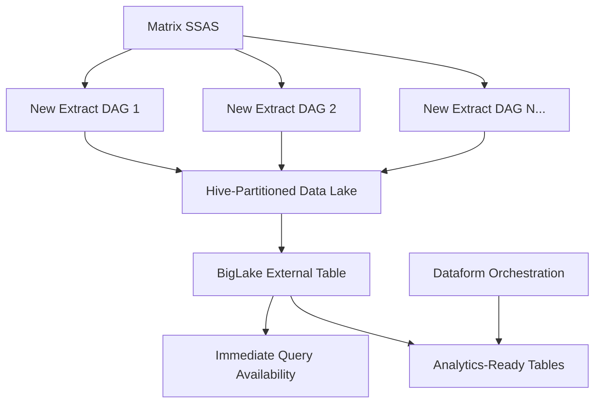
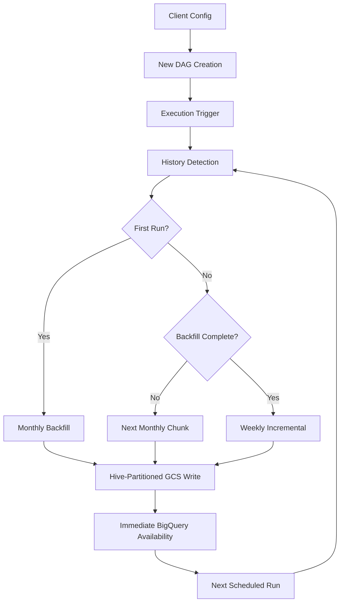

# Dynamic Backfill Solution Design with BigLake Integration

## Overview

This dgs://au-accel-mdw-dev-biglake-poc/matrix/raw/
├── year=2023/month=06/week=backfill_20230601/client=dpe/booking_spot.csv
├── year=2025/month=09/week=20250925/client=dpe/booking_spot.csv
├── year=2025/month=09/week=20250925/client=cba/booking_spot.csv
└── year=2025/month=09/week=20250925/client=ford/booking_spot.csvnt outlines the design for an intelligent backfill and incremental data extraction system for the Matrix to GCS pipeline, fully integrated with the BigLake + Dataform architecture. The solution automatically determines whether to perform bulk historical extraction or incremental weekly updates based on DAG execution history, while writing data to a hive-partitioned structure optimized for immediate BigQuery analysis.

## Problem Statement

The current Matrix data extraction system has several limitations:

1. **Inefficient Backfilling**: New clients require manual backfilling week by week
2. **Fixed Date Ranges**: All DAGs use the same weekly date calculation regardless of data history
3. **Manual Intervention**: Adding new clients requires understanding of backfill requirements
4. **Resource Constraints**: Limited by SSH connection capacity and source database strain
5. **Data Pipeline Complexity**: Separate extract and load DAGs with complex dependencies
6. **Delayed Data Availability**: Data not available until load DAGs complete

## Solution Goals

- **Zero Configuration**: Add client to config → automatic backfill and immediate data availability
- **Self-Healing**: Ability to reprocess data by clearing DAG history
- **Resource Efficient**: Monthly chunks for backfill, weekly incremental for ongoing
- **Robust**: No external dependencies or flaky state management, works within legacy system constraints
- **Client-Independent**: Each client operates at its own pace
- **Immediate Availability**: Data queryable in BigQuery as soon as extraction completes
- **Cost Optimized**: Date-first partitioning for efficient time-based queries
- **Legacy Compatible**: Designed to work around database throughput limitations

## Architecture

### Integrated Architecture with BigLake
This solution integrates seamlessly with the BigLake + Dataform architecture (see `biglake-dataform-architecture.md`) to provide end-to-end automation from extraction to analysis-ready data.



### Core Components



### Detection Logic Flow

1. **DAG Run History Query**: Query Airflow metadata for successful runs
2. **Mode Determination**: 
   - No successful runs = Monthly backfill mode (start with first month)
   - Successful runs exist but backfill incomplete = Continue monthly backfill
   - Backfill complete (reached current month) = Weekly incremental mode
3. **Date Range Calculation**: Calculate appropriate start/end dates based on mode and progress
4. **GCS Path Generation**: Generate hive-partitioned path using date-first structure
5. **Extraction Execution**: Run extraction with dynamic parameters optimized for monthly/weekly chunks
6. **Immediate Availability**: Data instantly available for BigQuery querying

## BigLake Integration Specifics

### GCS Path Structure Requirements
The extraction DAGs must write data to the hive-partitioned structure expected by BigLake:

```
gs://au-accel-mdw-dev-biglake-poc/matrix/raw/
├── year=2023/month=01/week=backfill_202301/client=dpe/booking_spot.csv
├── year=2023/month=02/week=backfill_202302/client=dpe/booking_spot.csv
├── year=2023/month=03/week=backfill_202303/client=dpe/booking_spot.csv
├── ...
├── year=2025/month=09/week=backfill_202509/client=dpe/booking_spot.csv
├── year=2025/month=09/week=20250925/client=dpe/booking_spot.csv
└── year=2025/month=09/week=20250925/client=cba/booking_spot.csv
```

### Key Integration Points

1. **Immediate Data Availability**: Data is queryable in BigQuery the moment it lands in GCS
2. **Partition Optimization**: Date-first structure optimizes for time-based analytics queries
3. **Mixed Granularity Support**: Backfill and incremental data coexist seamlessly
4. **Cost Optimization**: Partition elimination reduces query costs dramatically
5. **Schema Consistency**: All files must maintain identical CSV structure

### External Table Configuration
The BigLake external table automatically discovers new partitions:

```sql
CREATE EXTERNAL TABLE `au-accel-mdw-dev.L01_raw_matrix.matrix_booking_spot_multi_tenant`
(
  SpotId STRING,
  BookingDate STRING,
  Amount STRING,
  Campaign STRING,
  ClientName STRING
)
WITH PARTITION COLUMNS (
  year STRING,
  month STRING,
  week STRING,
  client STRING
)
OPTIONS (
  format = 'CSV',
  uris = ['gs://au-accel-mdw-dev-biglake-poc/matrix/raw/*'],
  skip_leading_rows = 1,
  hive_partition_uri_prefix = 'gs://au-accel-mdw-dev-biglake-poc/matrix/raw'
);
```

### Query Performance Examples
Time-based queries benefit significantly from the date-first partitioning:

```sql
-- Excellent performance - single partition scan
SELECT client, SUM(CAST(Amount AS INT64)) as total
FROM matrix_booking_spot_multi_tenant 
WHERE year = '2025' AND month = '09'
GROUP BY client;

-- Good performance - multiple partitions but time-filtered
SELECT ClientName, AVG(CAST(Amount AS INT64)) as avg_amount
FROM matrix_booking_spot_multi_tenant
WHERE year >= '2024' AND client = 'DPE'
GROUP BY ClientName;
```

For detailed BigLake architecture and Dataform integration, see `biglake-dataform-architecture.md`.

## Testing Results and Monthly Chunking Decision

### Performance Testing Outcomes

During proof-of-concept testing with the Matrix legacy system, several key findings emerged:

**Large Backfill Performance:**
- **Full year extractions (2025-01-01 to 2025-09-26)**: Extremely slow, often timing out
- **Monthly extractions (2025-01-01 to 2025-01-31)**: Reliable and manageable performance
- **Compute resources**: CPU and memory did not cap out, indicating bottleneck is network/database-side

**System Constraints Identified:**
- **Legacy database throughput**: Matrix SSAS has inherent performance limitations
- **Network latency**: Multiple round-trips for large date ranges cause compounding delays
- **Connection stability**: Long-running queries risk connection timeouts

### Monthly Chunking Strategy Justification

Based on testing results, monthly chunking provides the optimal balance:

**Reliability Benefits:**
- **Proven to work**: Monthly extractions complete successfully within reasonable timeframes
- **Fault tolerance**: If one month fails, only that month needs retry (not entire backfill)
- **Predictable duration**: Each month takes similar time, enabling reliable scheduling

**Operational Benefits:**
- **Progress visibility**: Clear month-by-month progress tracking
- **Manageable recovery**: Failed months can be individually reprocessed
- **Resource planning**: Consistent monthly resource usage patterns

**Legacy System Compatibility:**
- **Works with constraints**: Designed around Matrix system limitations rather than against them
- **Sustainable load**: Monthly chunks don't overwhelm the legacy database
- **Connection stability**: Shorter queries reduce timeout risk

This approach transforms what could be a problematic bulk backfill into a series of manageable, reliable monthly operations that progressively build the complete historical dataset.

## Implementation Considerations

### Resource Management
- **Timeout Adjustments**: Monthly timeouts for backfill operations (15000s), weekly for incremental (11000s)
- **Concurrent Limits**: Consider DAG-level concurrency for multiple client backfills
- **Monitoring**: Enhanced logging for monthly backfill progress with partition information
- **Legacy Compatibility**: Designed to work within Matrix database throughput constraints

### Error Handling
- **Monthly Failure Recovery**: Ability to resume from failure point month by month
- **Incremental Continuity**: Ensure weekly runs continue despite monthly backfill failures
- **Partition Validation**: Verify hive partition structure is created correctly for each month
- **Alerting**: Different alert thresholds for monthly backfill vs incremental with BigQuery availability checks
- **Progress Tracking**: Clear visibility into which months have been processed successfully

### Performance Optimization
- **Monthly Chunking Strategy**: Break large date ranges into monthly pieces for reliable processing
- **Connection Pooling**: Optimize SSH connection usage during monthly extractions
- **Database Impact**: Monitor source system performance during extended monthly operations
- **BigQuery Optimization**: Monitor partition pruning effectiveness and query performance
- **Legacy System Adaptation**: Work within Matrix database throughput limitations rather than against them

### 2. New DAG Structure (Non-Destructive Implementation)

**Important**: This implementation creates NEW DAGs alongside existing ones. No existing DAGs will be modified or removed during initial deployment.

```python
def create_new_dynamic_dag(dag_id, client_name, client_id, start_date):
    @dag(
        dag_id=f"{dag_id}_v2",  # New versioned DAG ID
        default_args={**default_args, 'start_date': start_date},
        description=f'Dynamic extraction for {client_name} with BigLake integration.',
        schedule='@weekly',
        catchup=False,
        max_active_runs=1,
    )
    def taskflow():
        start = ComputeEngineStartInstanceOperator(
            task_id="start_gce_instance_export",
            project_id=PROJECT_ID,
            zone=GCE_ZONE,
            resource_id=GCE_INSTANCE
        )

        copy_scripts = SSHOperator(
            task_id='load_dependencies',
            ssh_conn_id='ssh_default',
            command=setup_command,
            cmd_timeout=600
        )

        @task
        def determine_extraction_parameters():
            """Determine extraction mode and GCS path based on DAG history"""
            params = get_extraction_period_with_gcs_path(
                dag_id=context['dag'].dag_id,
                execution_date=context['execution_date'], 
                client_start_date=start_date,
                client_name=client_name
            )
            
            logging.info(f"Extraction parameters for {client_name}: {params}")
            return params

        @task_group(group_id='matrix_extract_to_gcs')
        def extract():
            params = determine_extraction_parameters()
            
            # Dynamic extract command with hive-partitioned output
            extract_command = f"""cmd.exe /c python .scripts/main.py 
                --project-id={PROJECT_ID} 
                --destination-bucket=au-accel-mdw-dev-biglake-poc 
                --output-path={params['gcs_path']}
                --server-name={SERVER_NAME} 
                --catalog={CATALOG} 
                --user-id-secret={USER_ID_SECRET} 
                --password-secret={PASSWORD_SECRET} 
                --start-date={params['start_date']}
                --end-date={params['end_date']}
                --client-ids={client_id}
                --client-name="{client_name}" 
                --source-table="booking_spot_2"
                --output-filename="booking_spot.csv"
            """
            
            logging.info(f"Running {params['mode']} extraction for {client_name}: {extract_command}")

            SSHOperator(
                task_id=f'extract_{client_name}_table',
                ssh_conn_id='ssh_default',
                command=extract_command.replace('\n', ' '),
                cmd_timeout=11000 if params['mode'] == 'weekly' else 30000,  # Longer timeout for bulk
                doc_md=f'{params["mode"].title()} extraction for {client_name} to hive-partitioned structure'
            )

        stop = ComputeEngineStopInstanceOperator(
            task_id="stop_gce_instance",
            project_id=PROJECT_ID,
            zone=GCE_ZONE,
            resource_id=GCE_INSTANCE
        )

        start >> copy_scripts >> determine_extraction_parameters() >> extract() >> stop

    return taskflow()

# Create NEW DAGs alongside existing ones (non-destructive)
# Initially filter to single client for testing
test_client = {'client_name': 'DPE', 'client_ids': "15854,15853,15442", 'start_date': '2023-06-01'}

dag_id = f'matrix_export_{test_client["client_name"]}_to_gcs'
client_name = test_client['client_name']
client_ids = test_client['client_ids'] 
start_date = datetime.strptime(test_client['start_date'], '%Y-%m-%d')

# Create the new dynamic DAG
globals()[f"{dag_id}_v2"] = create_new_dynamic_dag(dag_id, client_name, client_ids, start_date)
```

### 3. Monthly Chunking Strategy (Proven Approach)

Based on testing with legacy Matrix systems, monthly chunking provides the optimal balance of reliability and performance:

```python
def get_extraction_period_with_monthly_chunks(dag_id, execution_date, client_start_date, client_name):
    """Monthly chunking strategy - proven reliable with Matrix legacy systems"""
    
    successful_runs = DagRun.find(dag_id=dag_id, state=DagRunState.SUCCESS)
    client_start_dt = datetime.strptime(client_start_date, '%Y-%m-%d')
    current_date = datetime.now()
    
    if len(successful_runs) == 0:
        # First run - extract first month only
        start_date = client_start_date
        end_of_month = client_start_dt.replace(day=1) + timedelta(days=32)
        end_of_month = end_of_month.replace(day=1) - timedelta(days=1)
        end_date = min(end_of_month, current_date).strftime('%Y-%m-%d')
        
        # Monthly backfill partition
        month_id = f"backfill_{client_start_dt.strftime('%Y%m')}"
        gcs_path = f"matrix/raw/year={client_start_dt.year}/month={client_start_dt.month:02d}/week={month_id}/client={client_name.lower()}"
        
        return {
            'mode': 'backfill_monthly',
            'start_date': start_date,
            'end_date': end_date,
            'gcs_path': gcs_path
        }
    
    # Determine if we're still in backfill mode or ready for incremental
    # Find the latest month we've successfully processed
    latest_run_month = find_latest_processed_month(successful_runs, client_start_dt)
    next_month = latest_run_month + timedelta(days=32)
    next_month = next_month.replace(day=1)
    
    if next_month.year < current_date.year or (next_month.year == current_date.year and next_month.month < current_date.month):
        # Continue monthly backfill
        start_date = next_month.strftime('%Y-%m-%d')
        end_of_month = next_month.replace(day=1) + timedelta(days=32)
        end_of_month = end_of_month.replace(day=1) - timedelta(days=1)
        end_date = min(end_of_month, current_date).strftime('%Y-%m-%d')
        
        month_id = f"backfill_{next_month.strftime('%Y%m')}"
        gcs_path = f"matrix/raw/year={next_month.year}/month={next_month.month:02d}/week={month_id}/client={client_name.lower()}"
        
        return {
            'mode': 'backfill_monthly',
            'start_date': start_date,
            'end_date': end_date,
            'gcs_path': gcs_path
        }
    else:
        # Backfill complete - switch to weekly incremental
        start_of_week = current_date - timedelta(days=current_date.weekday())
        end_of_week = start_of_week + timedelta(days=6)
        
        start_date = start_of_week.strftime('%Y-%m-%d')
        end_date = end_of_week.strftime('%Y-%m-%d')
        week_id = end_of_week.strftime('%Y%m%d')
        
        gcs_path = f"matrix/raw/year={current_date.year}/month={current_date.month:02d}/week={week_id}/client={client_name.lower()}"
        
        return {
            'mode': 'incremental_weekly',
            'start_date': start_date,
            'end_date': end_date,
            'gcs_path': gcs_path
        }

def find_latest_processed_month(successful_runs, client_start_dt):
    """Helper function to find the latest month successfully processed"""
    if not successful_runs:
        return client_start_dt
    
    # Logic to parse DAG run dates and find latest month
    # Implementation would track which month each run processed
    # This is a simplified version - actual implementation would be more robust
    latest_run = max(successful_runs, key=lambda x: x.execution_date)
    months_processed = len(successful_runs)
    
    latest_month = client_start_dt
    for i in range(months_processed - 1):
        latest_month = latest_month.replace(day=1) + timedelta(days=32)
        latest_month = latest_month.replace(day=1)
    
    return latest_month
```

**Key Benefits of Monthly Chunking:**
- **Proven Reliable**: Testing confirmed monthly extractions complete successfully
- **Predictable Performance**: Each month takes similar time (manageable)
- **Progressive**: Makes steady, visible progress month by month
- **Fault Tolerant**: If one month fails, only need to retry that month
- **Legacy Compatible**: Works within Matrix database throughput constraints
- **Monitoring Friendly**: Easy to track progress ("Currently processing July 2024")

## Operational Scenarios

### Scenario 1: New Client Onboarding with BigLake Integration

**Action**: Create new v2 DAG for testing client (initially just DPE)
```python
# In new DAG file: matrix_export_to_gcs_v2.py
test_client = {'client_name': 'DPE', 'client_ids': "15854,15853,15442", 'start_date': '2023-06-01'}
dag_id = f'matrix_export_{test_client["client_name"]}_to_gcs_v2'
```

**Automatic Behavior**:
1. New DAG `matrix_export_DPE_to_gcs_v2` created alongside existing DAGs
2. First execution detects no history → monthly backfill mode
3. Extracts first month (2023-01-01 to 2023-01-31)
4. Writes to: `matrix/raw/year=2023/month=01/week=backfill_202301/client=dpe/booking_spot.csv`
5. Data immediately available in BigQuery via external table
6. Next run extracts second month (2023-02-01 to 2023-02-28)
7. Continues monthly until reaching current month
8. Switches to weekly incremental mode for ongoing operations
9. Weekly data writes to: `matrix/raw/year=2025/month=09/week=20250925/client=dpe/booking_spot.csv`

### Scenario 2: Data Reprocessing with Partition Management

**Action**: Clear DAG run history in Airflow UI

**Automatic Behavior**:
1. Next scheduled run detects no successful runs
2. Automatically switches to monthly backfill mode
3. Generates new monthly partitions (avoids overwriting existing data)
4. Reprocesses historical data month by month to new partitions
5. Data available immediately for comparison/validation
6. Returns to weekly incremental mode after backfill completes

### Scenario 3: Weekly BAU Operations with Immediate Availability

**Action**: None required

**Automatic Behavior**:
1. Weekly schedule triggers DAG
2. Detects successful run history → incremental mode
3. Extracts current week's data
4. Writes to time-appropriate partition: `year=2025/month=09/week=20250925/client=DPE/`
5. Data immediately queryable in BigQuery
6. Continues indefinitely with zero maintenance

## Benefits

### Operational Benefits
- **Zero Manual Intervention**: Complete automation from config to BigQuery availability
- **Self-Healing**: Automatic recovery from data issues
- **Resource Optimization**: Bulk when needed, incremental for efficiency
- **Independent Client Management**: Each client operates autonomously
- **Immediate Data Access**: Query data as soon as extraction completes
- **Non-Destructive Deployment**: New DAGs created alongside existing ones for safe testing

### Technical Benefits
- **No External Dependencies**: Uses Airflow's native metadata
- **Deterministic Logic**: Predictable behavior based on run history
- **Maintainable**: Single DAG pattern for all clients
- **Auditable**: Clear decision trail in task logs
- **BigQuery Optimized**: Date-first partitioning for cost-effective time-based queries
- **Scalable Storage**: Cost-effective GCS storage with BigQuery compute model
- **Legacy Resilient**: Monthly chunking works within Matrix system constraints
- **Progressive**: Clear month-by-month progress visibility

### Business Benefits
- **Faster Client Onboarding**: Minutes from extraction to analysis-ready data
- **Reduced Operational Overhead**: No manual backfill or load DAG management
- **Improved Data Reliability**: Consistent extraction patterns with immediate validation
- **Enhanced Analytics Capability**: Immediate query access enables faster insights
- **Cost Efficiency**: Optimized storage and compute costs through proper partitioning

## Implementation Roadmap

### Phase 1: Safe Deployment and Testing (Week 1)
1. **Create New DAG File**: `matrix_export_to_gcs_v2.py`
   - Implement dynamic backfill logic with BigLake integration
   - Configure for single test client (DPE) only
   - Deploy alongside existing DAGs (non-destructive)

2. **Update Extraction Script**: Modify `scripts/matrix_export/main.py`
   - Add `--output-path` parameter for hive-partitioned structure
   - Support flexible date ranges for backfill vs incremental
   - Ensure backward compatibility with existing DAGs

3. **Test Backfill Execution**
   - Run DPE v2 DAG manually
   - Verify bulk extraction creates proper hive partitions
   - Validate data appears in BigQuery external table immediately
   - Test incremental runs after successful backfill

### Phase 2: BigQuery Integration Validation (Week 2)
1. **External Table Setup**
   - Create production BigLake external table pointing to new partition structure
   - Test query performance with partition elimination
   - Validate mixed granularity querying (backfill + incremental)

2. **Dataform Integration**
   - Create basic Dataform models to consume new hive-partitioned data
   - Test transformations across backfill and incremental partitions
   - Validate data quality and completeness

3. **Monitoring and Alerting**
   - Set up monitoring for new DAG execution
   - Create alerts for extraction failures or data quality issues
   - Document operational procedures

### Phase 3: Gradual Rollout (Week 3-4)
1. **Multi-Client Testing**
   - Extend v2 DAGs to include 2-3 additional clients
   - Test concurrent backfill operations
   - Validate partition isolation and performance

2. **Production Readiness**
   - Performance testing with realistic data volumes
   - Disaster recovery testing (DAG history clearing)
   - Documentation and training for operations team

3. **Migration Strategy Planning**
   - Define cutover plan from v1 to v2 DAGs
   - Plan for existing data migration to new structure
   - Prepare rollback procedures

### Phase 4: Full Migration (Week 5-6)
1. **Complete Client Migration**
   - Roll out v2 DAGs for all clients
   - Migrate historical data to new partition structure
   - Deprecate existing extract and load DAGs

2. **Optimization and Cleanup**
   - Fine-tune partition strategies based on usage patterns
   - Remove legacy DAGs and associated infrastructure
   - Optimize Dataform transformations for new structure

## Future Enhancements

1. **Smart Chunking**: Automatic chunk size optimization based on data volume
2. **Progressive Backfill**: Gradual catchup from oldest to newest
3. **Data Quality Checks**: Validation between bulk and incremental extracts
4. **Metrics Dashboard**: Visualization of backfill progress and performance
5. **Cost Optimization**: Schedule bulk operations during off-peak hours

## Conclusion

This dynamic backfill solution, fully integrated with the BigLake + Dataform architecture, provides a comprehensive approach to automated data extraction and immediate analytics availability. By combining intelligent backfill logic with modern data lake patterns, the system achieves the ultimate goal of zero-configuration client onboarding with immediate data access.

The key innovation is the seamless integration between:
- **Smart Extraction Logic**: Automatic detection of backfill vs incremental needs
- **Optimized Storage Structure**: Date-first hive partitioning for cost-effective queries  
- **Immediate Availability**: BigLake external tables provide instant query access
- **Mixed Granularity Support**: Backfill and incremental data coexist naturally
- **Non-Destructive Deployment**: Safe rollout alongside existing systems

This architecture transforms the Matrix data pipeline from a complex, manually-managed ETL system into a modern, self-service data platform that scales effortlessly with business growth while maintaining operational excellence and cost efficiency.

The phased implementation approach ensures safe deployment with the ability to validate each component before full migration, minimizing risk while maximizing the benefits of modern data architecture patterns.